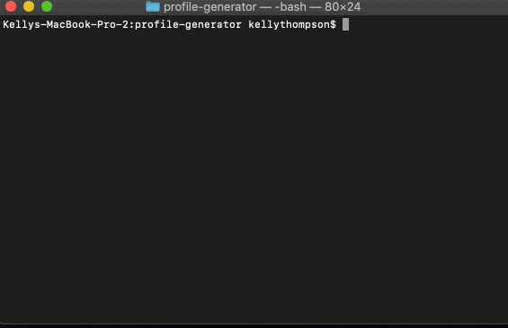

# Profile Generator

This is a CLI that takes a Github username and a color. It will then dynamically generate an html file and a pdf file containing details from said user’s Github account (name, username, bio, picture, location, Github profile, portfolio, number of followers, number of people they follow, number of stars, and number of public repos) with a background that matches the selected color.
